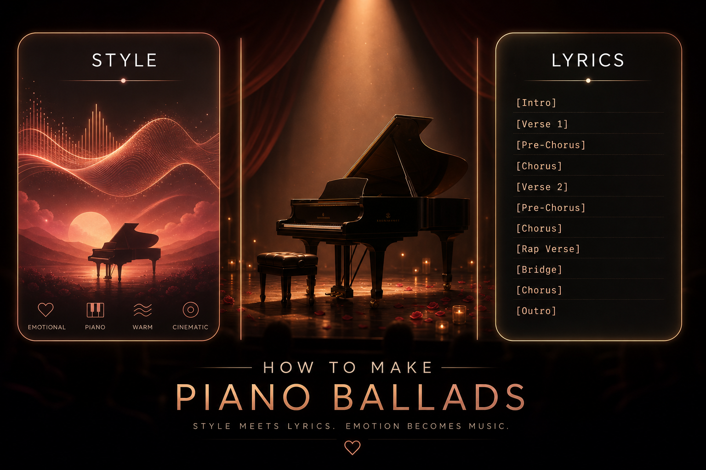
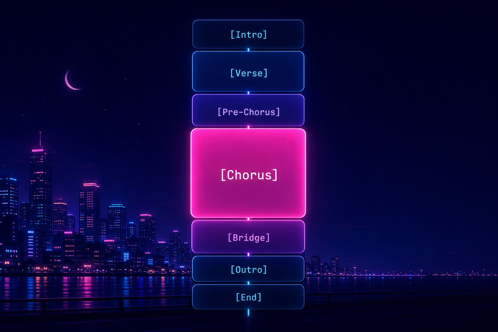

# 我把 Suno 的标签写法掰开揉碎讲给你听，照着抄就能做出一首古风叙事歌



故事是这样的。

前段时间，好几个朋友问我同一个问题，说卡兹克你天天用 Suno，我也充了会员，可我出的歌怎么总像开盲盒。同一段描述，点十次生成，十个味儿。要么前奏还没完人就开唱了，要么副歌平平无奇，要么唱到一半 AI 自己加了段莫名其妙的东西。

我特别理解这种感觉。

因为我一开始也这样。那会儿我以为 Suno 是个许愿池，我在框里写「一首好听的古风歌」，它就该给我吐一首林俊杰的《醉赤壁》出来。结果当然是，给我整不会了。。。

后来我才搞明白，不是 Suno 不行，是我没跟它好好说话。

说实话，写这种教程类的东西我一直有点心理负担，怕写得太浅大佬嫌弃，写得太深小白看不懂。所以这篇我就当是讲给一个完全没碰过 Suno 的朋友听，从零开始，一个字一个字地白话。

而且这次我不想干讲，我想带你真的做出一首歌来。

我们要做的，是一首古风叙事歌。讲一个江南女子，守着一城烟雨，等一个披甲北上、再没回来的人。雨声、寺钟、古筝、二胡，到最后是四个字，意难平。我给它起了个名字，就叫《意难平》。

你不用记任何东西，跟着往下读就行。读到最后，我会把我们一路攒出来的那段提示词，完完整整地贴给你，你直接复制，丢进 Suno，就能听到这首《意难平》到底长什么样。

那我们开始。

---

## 0 先搞懂一件最关键的事，Suno 里有两个框

这是所有问题的根。

很多人卡住，不是标签写错了，是压根没分清 Suno 那两个输入框是干嘛的。你打开 Custom 模式（就是自定义模式，别用那个一句话生成的简易模式），会看到两个大框。

一个叫 Style，风格框。

一个叫 Lyrics，歌词框。

它俩管的事完全不一样，记住这句话你就赢了一半，风格框管「这首歌长什么样」，歌词框管「这首歌怎么唱、怎么排」。

打个我自己常用的比方。你去定做一身衣裳，Style 框是你跟师傅说「我要一身水墨色的、素净的、带点烟雨气的古装」，这是整体气质。Lyrics 框是你拿出图样说「这儿绣枝杏花，这段留白，那一处用真丝」，这是具体到每一处的执行。

气质和执行，是两回事。你要是把「这儿绣杏花」写进了气质描述里，师傅就懵了。同理，你把段落结构写进了 Style 框，Suno 也懵。

所以这篇文章，其实就是带你分别把这两个框填明白。Style 框我们讲一块，歌词框我们讲三块，加起来五个维度，每讲一个，就往我们《意难平》的成品里塞一块。塞完之后，再单独聊聊框外面那个最影响第一耳朵的东西，人声怎么调。

走着。

---

## 1 Style 框怎么写，记住一个五元素公式就够了


先说 Style 框。

这个框你可以理解成，你在给 AI 下一份「声音的简报」。Suno 读这个框的方式很有意思，它不是把你的话当句子读，而是当成一堆「加权的关键词」，每个词都把结果往一个方向拽一下。

这就带来两个特别实用的小知识。

第一，重要的词放前面。 Suno 对前面那二三十个字最敏感，所以最核心的东西，曲风、主乐器，要顶到最前头。后面再补细节。

第二，词不是越多越好。 最舒服的数量是八到十五个词。少于五个，AI 觉得你没说清，它就自己脑补；多过二十个，词跟词开始打架，结果反而稀。

那到底写哪些词呢。你别瞎想，背一个公式就行，五个元素，按这个顺序排。

```
曲风 + 年代, 情感氛围, 主要乐器（最多两三种）, 人声特质, 制作风格 + BPM
```

我挨个说一下，特别是有几个小白最容易忽略的点。

曲风要写准。 古风这种，光写 `Chinese` 不够，写 `Mandarin folk ballad`（华语民谣抒情）加一个 `modal Chinese melody`（中国五声调式），AI 一下就知道你要的是那个韵味，而不是个穿汉服的流行歌。

人声那块，要说三层。 这是从「能听」到「好听」的分水岭。光写 `female vocal`（女声），那是新手。真正的写法是说三层，她是谁、她怎么唱、加什么音效。比如 `airy female vocal`（空灵的女声）是第一层，`breathy humming and restrained delivery`（气声哼唱、克制地唱）是第二层，`wet room reverb`（潮湿的房间混响）是第三层。三层叠起来，那个人声才立得住。

但光给你一个公式，其实等于没给。

因为你真上手的时候，一定会卡在「我到底该填哪些词」。所以我把自己平时最常用的一批词，按类别拍成了几张速查表贴在下面，你写的时候缺哪一类，就来这儿挑，后面括号里是中文意思，纯小白照着抄就行。

不用背，理解每一类是干嘛的，然后每类挑一两个串起来，就是一段合格的 Style。

**① 曲风（这一栏最重要，永远放最前面）**

| 英文标签 | 中文意思 |
| --- | --- |
| Mandarin folk ballad | 华语古风民谣 |
| Guofeng | 古风 |
| Chinese folk | 中国民乐风 |
| modal Chinese melody | 中国五声调式 |
| Pop | 流行 |
| Mandopop | 华语流行 |
| Ballad | 抒情慢歌 |
| R&B | 节奏布鲁斯 |
| City Pop | 都市流行，日系复古 |
| Rock | 摇滚 |
| Folk | 民谣 |
| Indie | 独立音乐 |
| EDM | 电子舞曲 |
| Lo-fi | 低保真，慵懒风 |
| Jazz | 爵士 |
| Cinematic | 电影配乐感 |
| Ambient | 氛围音乐 |
| Acoustic | 不插电 |

**② 年代（加上它，曲风准确度肉眼可见地涨）**

| 英文标签 | 中文意思 |
| --- | --- |
| ancient Chinese | 古代中国意境 |
| 80s | 八十年代复古 |
| 90s | 九十年代 |
| 2000s | 千禧年代 |
| 2010s | 一零年代 |

**③ 情感氛围**

| 英文标签 | 中文意思 |
| --- | --- |
| melancholic | 忧郁 |
| sorrowful | 悲怆 |
| restrained | 克制 |
| nostalgic | 怀旧 |
| bittersweet | 苦乐参半 |
| longing | 思念 |
| desolate | 苍凉 |
| intimate | 亲密 |
| warm | 温暖 |
| dreamy | 梦幻 |
| epic | 史诗恢弘 |
| Ethereal | 空灵（实测常被 Suno 忽略，想稳改用 dreamy） |
| anthemic | 燃，有大合唱感 |

**④ 乐器（最多挑两三种，别贪多）**

| 英文标签 | 中文意思 |
| --- | --- |
| guzheng | 古筝 |
| erhu | 二胡 |
| pipa | 琵琶 |
| guqin | 古琴 |
| bamboo flute | 笛 / 箫 |
| temple bell | 寺钟 |
| felt piano | 毡音钢琴，柔软 |
| grand piano | 三角钢琴 |
| acoustic guitar | 木吉他 |
| strings | 弦乐 |
| string drones | 弦乐铺底长音 |
| brushed percussion | 鼓刷 |
| synth | 合成器 |
| 808 | 808 低音鼓机 |

**⑤ 人声（记得分三层，谁唱 / 怎么唱 / 加什么音效）**

| 英文标签 | 中文意思 |
| --- | --- |
| female vocal | 女声 |
| male vocal | 男声 |
| duet | 男女对唱 |
| airy | 空灵 |
| breathy | 气声 |
| soft | 柔和 |
| restrained | 克制 |
| powerful | 有力 |
| soaring | 高亢飞扬 |
| belted | 放声高唱 |
| operatic | 戏腔 / 美声 |
| humming | 哼唱 |
| spoken word | 念白，说不唱 |
| intimate | 亲密贴耳 |
| layered harmonies | 多层和声 |

**⑥ 制作与音色**

| 英文标签 | 中文意思 |
| --- | --- |
| wet room reverb | 潮湿的房间混响 |
| lo-fi ambience | 低保真氛围 |
| clean mix | 干净的混音 |
| warm analog | 温暖的模拟感 |
| moderate rubato | 自由速度，不卡死节拍 |
| call-and-response | 一问一答 |
| sparse arrangement | 稀疏编曲 |
| cinematic production | 电影级制作 |
| full band | 全编制乐队 |

**⑦ 速度 BPM（不知道填多少，照这个范围抄）**

| 风格 | 大概 BPM |
| --- | --- |
| 古风 / 抒情慢歌 | 60-80 |
| Lo-fi | 65-85 |
| R&B | 60-90 |
| City Pop | 85-110 |
| 流行 Pop | 100-130 |
| 摇滚 Rock | 110-140 |
| House / EDM | 120-130 |

表是死的，搭配是活的。 你不用全用上，每一类挑一两个最对味的，按前面那个公式的顺序串起来，一段 Style 就成了。对了，这些词是描述，不是开关，Suno 会朝那个方向靠，但响应有强有弱，个别词比如 ethereal 它干脆懒得理你。所以重要的方向，多写一两个近义词去强化，比押宝单个词稳。

好，公式和速查表都给你了，我们当场就给《意难平》写一段 Style。

我想要的感觉是，下着雨的江南，钢琴很轻，远处一声寺钟，古筝是主角、二胡在旁边一句句应和，女声先是空灵地哼着，整体克制、不煽情，像一个普通的雨天，但底下压着很重的东西。

那我就照着公式，从速查表里挑词填。

```
Rain-soaked Mandarin folk ballad with sparse felt piano, distant temple bell, airy humming, guzheng lead and erhu call-and-response. Soft brushed percussion, wet room reverb, delicate string drones, intimate lo-fi ambience, modal Chinese melody, moderate rubato, restrained everyday-tuesday tone.
```

你看，曲风（Mandarin folk ballad、modal Chinese melody）和主乐器（毡音钢琴、寺钟、古筝主奏、二胡一问一答）顶在最前面，然后情感（克制、像个平常的周二，不煽情），然后氛围和制作（潮湿房间混响、lo-fi、自由速度）。我没写死 BPM，因为最后写了 `moderate rubato`，让它自由地呼吸，古风歌这样反而更有味道。

这一段，就是我们成品的第一块。先收着。

哦对，你可能会问，能写中文吗。能，但 Suno 对英文的理解明显更准，所以我的习惯是，风格描述用英文，唱中文歌就让歌词去承担中文，就像我们待会儿要填的那一整篇词。

---

## 2 歌词框的骨架，靠的是结构标签



风格框搞定，我们切到歌词框。

很多人写歌词，就是把一段话直接糊进去，然后 AI 唱得一团乱，没有前奏、没有副歌、想停哪儿停哪儿。

为啥呢。因为你没给它骨架。

歌词框里有一种东西，叫结构标签，就是用方括号 `[ ]` 框起来的词，单独占一行，放在每一段的最前面。它的作用就是告诉 AI，从这儿开始是主歌，从那儿开始是副歌。这是给整首歌搭骨架。

常用的就那么几个，我用大白话给你标一下，纯小白看这一个表就够了。

```
[Intro]        前奏，让歌先呼吸两秒
[Verse]        主歌，讲故事的部分，能量低一点
[Pre-Chorus]   预副歌，副歌前的助跑，情绪往上爬
[Chorus]       副歌，最抓耳、要循环洗脑的部分
[Interlude]    间奏，一般是纯乐器
[Bridge]       桥段，整首歌唱腻了，来段不一样的打破一下
[Outro]        尾奏，收尾
[End]          强制结束，怕 AI 唱不完没完没了就加它
```

记住三个规矩，标签单独占一行，放段落开头，整首歌里同一个标签的写法要前后一致。就这么简单。

这里有个小白百分百会遇到的坑，我提前给你填了。你写了 `[Intro]` 想要个纯音乐前奏，结果 AI 还是上来就开唱。咋办。在 `[Intro]` 后面写细一点，写成 `[Intro: piano and light rain sound, distant temple bell]`，告诉它前奏里有什么，它就不瞎唱了。

说到前奏，顺便教你两个让歌一下子高级起来的小招。

第一个，前奏哼唱。 你有没有发现，很多特别勾人的歌，一开口不是唱词，是一段「嗯～」的哼唱。在 Suno 里太好实现了，前奏后面跟一行 `[Humming] 嗯～嗯～ 嗯嗯嗯～`，AI 就会哼一段旋律开场。元音用「嗯～」「啊～」加波浪号最稳，波浪号是告诉它把这个音拖长。

第二个，用小节数和具名乐器控制段落。 这是进阶玩法。你可以在标签里直接写 `[Intro: 8 bars, ...]` 告诉它前奏大概多长，也可以写 `[Interlude: guzheng solo with erhu answering, 12 bars]`，指定这段间奏是古筝独奏、二胡来一问一答地应和。我得诚实说一句，Suno 对小节数不一定卡得很准，这玩意儿是给它一个强烈的引导，不是精确的命令，但写了比不写强很多。

行，继续攒我们的《意难平》。我先不写词，先把骨架搭出来，你感受一下这首歌的架子。

```
[Intro: 8 bars, piano and light rain sound, distant temple bell]
[Humming]

[Verse 1]

[Verse 2]

[Pre-Chorus]

[Chorus]

[Interlude: guzheng solo with erhu answering, 12 bars]

[Verse 3]

[Verse 4]

[Pre-Chorus - variation]

[Chorus - higher energy]

[Bridge - spoken style, slow]

[Chorus - key change up, full emotion]

[Outro]
[Bamboo flute fade out, 8 bars]

[End]
```

看见没，雨声寺钟里哼唱开场，四段主歌把故事讲完整，中间挂一段古筝二胡的间奏喘口气，副歌反复出现、但一次比一次猛，最后桥段念白、再升调收束，尾奏让一支竹笛慢慢消失，强制结束。这就是一首有起伏、能讲完一整个故事的骨架，现在它还是空的，但架子立住了。

这是成品的第二块。

---

## 3 行内标签，让你像个导演一样指挥 AI 怎么唱


骨架有了，但歌还是平的。

为啥平。因为从头到尾一个力度唱下来，没有强弱、没有戏。这时候就要请出我最喜欢的一类标签，行内标签。

如果说结构标签是搭骨架，那行内标签就是你当导演，在某一段、某一句旁边小声说，这儿哼着来，那儿念白，这一遍副歌给我比上一遍更猛。

这块东西有点多，但你别慌，我直接给你拍一张速查表，下次写歌缺哪个回来抄就行。

**① 唱法情绪（写在某句词前面，用小括号）**

| 标签 | 中文意思 |
| --- | --- |
| (whispered) | 耳语、气声，亲密神秘 |
| (soft) / (gentle) | 轻柔、温柔 |
| (breathy) | 气声 |
| (belted) | 放声高唱、爆发 |
| (powerful) | 有力 |
| (falsetto) | 假音 |
| (vibrato) | 颤音 |
| (spoken) | 念白，说话不唱 |
| (humming) | 哼唱 |
| (emotional) | 充满情感 |
| (harmonized) | 这句加和声 |
| (ad-lib) | 即兴花腔 |

**② 段落演唱类型与变奏（加在 `[Verse]` `[Chorus]` 后面，用冒号或连字符接描述）**

| 标签 | 中文意思 |
| --- | --- |
| [Humming] | 整段哼唱 |
| [Opera ad-lib] | 戏腔即兴 |
| [Whispered Verse] | 气声主歌 |
| [Bridge - spoken style, slow] | 念白桥段、放慢 |
| [Chorus - higher energy] | 这遍副歌更燃 |
| [Chorus - key change up, full emotion] | 副歌升调、情绪拉满 |
| [Pre-Chorus - variation] | 预副歌变奏 |

**③ 能量与动态（单独占一行，插在歌词中间）**

| 标签 | 中文意思 |
| --- | --- |
| [Build] | 能量往上爬 |
| [Drop] | 先憋住再砸下来 |
| [Stop] | 突然停顿 |
| [Break] | 短暂休止 |
| [Climax] | 推到最高潮 |
| [Key Change Up] | 升调，情绪升华 |
| [Fade Out] | 渐弱消失 |

**④ 和声与背景人声**

| 标签 | 中文意思 |
| --- | --- |
| [Harmonies] | 加一层和声，最稳 |
| [Backing Vocals] | 背景和声，稳 |
| [Choir] | 合唱团 |
| [Lush BGVs: "词"] | 厚背景和声并指定唱词（进阶，来源单一，不保证稳定） |
| [BVs echo: "词"] | 背景人声回声重复（进阶，不保证稳定） |
| [BVs in thirds: "词"] | 三度和声（进阶，不保证稳定） |

用这些标签之前，有句大实话我得先说。

这些方括号标签，是信号，不是命令。 你写了，是在告诉 AI 你想要啥，但它不一定百分百照做，而且不同标签的听话程度差很远。像 humming、spoken、belting、whisper 这几个，基本写了就中，是最稳的一档。像副歌变奏、升调、那几个指定背景和声唱词的，属于看运气的一档，最好在 Style 框和歌词里都提一嘴，命中率更高。还有些参数类的纯属安慰剂，比如有人写 [Reverb: 30%] 这种数值，Suno 根本不认，白写。

所以别指望写了标签就铁定生效，多生成几遍、把重要的标签前后呼应着写，才是正经办法。

表给你了，我挑这首《意难平》最吃重的两招，再多说两句。

第一招，哼唱和戏腔。 这首不靠飙高音炸场，靠的是气口和韵味。开头一段 `[Humming]` 把人带进雨里，结尾来一句 `[Opera ad-lib]` 的戏腔即兴，那股子古典的悲意一下就出来了。

第二招，也是这首的命门，副歌的逐次升级。 同样一段副歌，我让它出现三回，但每一回都给它换个标签往上顶。第一回就是普通的 `[Chorus]`，平铺直叙地讲；第二回写成 `[Chorus - higher energy]`，情绪更满；最后一回写成 `[Chorus - key change up, full emotion]`，直接升调、把情绪拉到顶。同一段词，三种温度，听感就是层层递进，这是华语情歌的经典催泪结构。

来，我们把这些标签全标进《意难平》的骨架里，你重点看那三遍副歌是怎么一遍比一遍狠的。

```
[Intro: 8 bars, piano and light rain sound, distant temple bell]
[Humming] 嗯～嗯～

[Verse 1]
（叙事，能量低）

[Chorus]
（第一遍，平铺）

[Interlude: guzheng solo with erhu answering, 12 bars]

[Pre-Chorus - variation]
（变奏，再往上推）

[Chorus - higher energy]
（第二遍，更燃）

[Bridge - spoken style, slow]
（念白，最痛的话说出来）

[Chorus - key change up, full emotion]
（第三遍，升调，情绪到顶）

[Outro]
[Opera ad-lib]
[Bamboo flute fade out, 8 bars]
[End]
```

哼唱开场，主歌平静叙事，副歌第一遍铺垫，间奏喘口气，第二遍副歌加码，桥段把最痛那句念白说出来，最后一遍副歌升调炸开，尾奏一句戏腔、一支竹笛渐渐消失，再 `[End]` 焊死结尾。

一个小提醒，行内标签别每行都加，加多了 AI 反而乱。就在情绪的关键转折点点一下，对比才强。

这是成品的第三块。骨架开始有血有肉了。

---

## 4 真正往里填中文歌词，可唱比好看更重要


现在到了最有人味儿的一步，填词。

古风词跟大白话的情歌不太一样，它讲究意象、对仗、用典，但有一条铁律是相通的，词得「能唱」，比写得「漂亮」重要。

我给你几条特别接地气的检查标准，古风也一样适用。

一句别太长。 一行的字数尽量匀着来，太长 AI 唱起来会赶拍子。你看《意难平》里「杏花疏雨 湿透了青石旧巷」，中间用空格断成意群，AI 就知道在哪儿换气。

句尾押韵、多用开口音。 副歌的韵脚押上，唱出来就顺。「缝入寒衣」「身许旌旗」「无人还」「惊了山川」，韵脚落在开口的音上，方便拖长、方便把情绪送出去。

生僻字小心点。 古风词爱用「烛灺」「旌旗」这种字，意境是有了，但 AI 可能念错。能用就用，拿不准的地方自己先念一遍，实在拗口就换一个近义的。这是古风词独有的坑。

留白。 间奏、尾奏这些地方不塞字，留给古筝和竹笛去说话，反而更有余韵。

好，废话不多说，把《意难平》的整篇词填进去。你顺着读，会发现它就是个完整的故事，从送别、守望，到听闻噩耗、意难平，每一段的情绪都往下沉一层。

```
[Intro: 8 bars, piano and light rain sound, distant temple bell]
[Humming] 嗯～嗯～ 嗯嗯嗯～ 嗯～嗯～
[Humming] 啊～～ 啊～啊～啊～～ 嗯～～

[Verse 1]
杏花疏雨 湿透了青石旧巷
乌篷独立 载不动半生惆怅
那夜君行 卸下了儒衫罗裳
挽强弓 披铁甲 别我向孤城北望

[Verse 2]
折柳桥头 犹记你掌心余温
战鼓催程 震碎了寒江月轮
九死一生 君言是许国之本
可怜我 闺中人 算不尽此去晨昏

[Pre-Chorus]
听 窗外是 淅淅沥沥的雨声
聚 散不由人 算不透的命
却听闻 塞外已是 漫天风雪甲衣冷

[Chorus]
我守江南 剪一缕青丝缝入寒衣
君在边关 踏万里黄沙身许旌旗
烽火连天 听传闻百战十无人还
血染甲衣 这一场泼墨惊了山川
最恨这 意难平 连理枝折断在宿命

[Interlude: guzheng solo with erhu answering, 12 bars]

[Verse 3]
春水东流 吹散了桃溪渡口
空帏烛灺 燃尽了欲说还羞
尺素难传 唯有那北风如吼
将相功 枯骨冢 算不明白头白首

[Verse 4]
夜阑灯灺 似听得铁骑奔腾
大漠孤烟 吞没你如玉面容
若得来生 愿君做寻常农家
洗铅华 隐烟雨 闲看那满路桑麻

[Pre-Chorus - variation]
看 阶前是 离离落落的青苔
念 故人归来 却撞入空白
仿佛听 狼烟深处 有你长枪破长空
这一场劫数 啊 终是将你 我掩埋

[Chorus - higher energy]
我守江南 燃三千枯香跪求神明
君在沙场 洒一腔热血莫唤孤魂
莫入我梦 怕见你形容枯槁归来
泪眼婆娑 偏打湿当年出嫁红腮
最恨这 意难平 盛世安宁换了生离
你护了 这方烟雨 却唯独 把我抛弃

[Bridge - spoken style, slow]
凭何 英雄名 换来一座 无字碑
凭何 功臣泪 只能流入 孤坟堆
我不要 这万里江山 如画的壮美
我只要 你活着 归来
我只要 你活着 归来

[Chorus - key change up, full emotion]
苔痕染绿 阶前仍是旧时雨
沙场尘飞 谁人识得君名

[Outro]
[Humming] 嗯～嗯～ 嗯嗯嗯～ 嗯～嗯～
[Opera ad-lib] 啊～～ 咿～呀～～ 啊～～～
[Bamboo flute fade out, 8 bars]
[End]
```

念一遍，是不是一整个故事就立起来了。这就是叙事加可唱性。

这是成品的第四块，也是最厚的一块。

---

## 5 最后一步，把不想要的东西踢出去


到这儿，其实主体已经齐了。但还差临门一脚，这一脚专治 AI 自作主张。

你有没有遇到过，明明想要一首素净的古风，AI 非给你配了段电子鼓，或者来了把失真电吉他。。。这时候你光说「我要干净」没用，你得直接告诉它「不要什么」。

两个办法。

简单的，在 Style 框最后面，直接用 `no` 加上你不想要的东西。比如这首《意难平》要的是雨声古筝那股素净，我就可以在风格描述最后补一句 `no electronic beats, no distortion, no modern pop drums`（不要电子节拍、不要失真、不要现代流行鼓）。

讲究的，Suno 还有个单独的 Exclude Styles 框（排除框），你把不想要的元素写进去，效果更干净。做纯古风、做纯伴奏的时候，这个框是神器。

行了，憋了一路，是时候把五块拼起来了。不过先别急，还有最后一件事，它不写进那两个框，却最影响你听到的第一耳朵，就是人声。

---

## 6 人声怎么调，从选性别到锁音色


前面教的，全是用文字去描述人声，写进 Style 框里。这是一条路，但 Suno 其实还给了你两个更直接的硬控制，就在界面上，纯小白特别容易漏掉。

第一个，人声性别。 这首《意难平》是闺中人的口吻，必须是女声。你光在 Style 里写 female vocal，有时候 AI 还是会给你飘成男声。最稳的办法是，在生成界面的高级选项（More Options）里，直接把 Vocal Gender 点成女声。文字描述加界面点选，双保险，人声性别才焊得死。

第二个，把喜欢的人声存下来，叫 Persona。 你哪天生成出一个特别对味的嗓子，舍不得，可以用 Create Voice 把它存成一个 Persona，下次写新歌直接调用，音色就锁定了。想做一整套风格统一的古风专辑，就靠它。这个是 Pro 会员的功能。

说完界面上的硬控制，回到文字描述这块。

其实调人声就三个入口。一个是界面上点性别，刚说了。一个是在歌词里用唱法标签指挥某一段怎么唱，比如这首用 `[Humming]` 和 `[Opera ad-lib]`。还有一个，就是在 Style 框里把人声的音色质感写清楚。

而这第三个入口，词到底怎么挑，我给你拍了张最全的人声速查表，从音域、音色、技巧、情绪、处理到特殊类型，一次看全。专门琢磨人声的时候，翻这一张就够。

**① 性别与音域（先定个大方向）**

| 标签 | 中文意思 |
| --- | --- |
| male vocal / female vocal | 男声 / 女声 |
| duet | 男女对唱 |
| soprano | 女高音 |
| alto | 女低音 |
| tenor | 男高音 |
| baritone | 男中音 |
| bass | 男低音 |
| child vocal | 童声 |
| androgynous vocal | 中性嗓 |

**② 音色特质（嗓子本身什么质感）**

| 标签 | 中文意思 |
| --- | --- |
| airy | 空灵 |
| breathy | 气声 |
| raspy | 沙哑 |
| husky | 低沉沙哑 |
| smooth | 顺滑 |
| warm | 温暖 |
| bright | 明亮 |
| deep | 浑厚低沉 |
| sweet | 甜美 |
| velvety | 丝绒般顺滑 |
| powerful | 有力 |

**③ 唱法与技巧（怎么发声）**

| 标签 | 中文意思 |
| --- | --- |
| operatic | 戏腔 / 美声 |
| belting | 放声高唱 |
| falsetto | 假音 |
| vibrato | 颤音 |
| vocal runs / riffs | 转音、花腔 |
| melisma | 一字多音 |
| whisper | 耳语 |
| spoken word | 念白 |
| humming | 哼唱 |
| head voice / chest voice | 头声 / 胸声（真实声乐术语，但 Suno 基本不响应，慎用） |

**④ 情绪与风格（带什么感情唱）**

| 标签 | 中文意思 |
| --- | --- |
| emotional | 充满情感 |
| intimate | 亲密贴耳 |
| tender | 温柔 |
| sorrowful | 悲怆 |
| longing | 充满思念 |
| restrained | 克制 |
| passionate | 热烈 |
| desolate | 苍凉 |

**⑤ 层次与处理（声音的厚度与空间）**

| 标签 | 中文意思 |
| --- | --- |
| layered harmonies | 多层和声 |
| doubled vocals | 双轨人声，更厚 |
| choir | 合唱团 |
| close-mic | 贴麦，亲密 |
| dry vocal | 干声，无混响 |
| reverb-drenched | 大量混响 |
| wet room reverb | 潮湿的房间混响 |
| lo-fi vocal | 低保真人声 |

**⑥ 特殊人声类型（想要特定风格）**

| 标签 | 中文意思 |
| --- | --- |
| operatic vocals | 戏腔 / 美声 |
| chant | 吟诵 |
| gospel vocals | 福音 |
| ad-libs | 即兴花腔 |
| jazz scat | 爵士拟声 |

挑词的逻辑跟之前一样，不用全用，每一类拎一两个最对味的串起来。

回到我们的《意难平》，我想要的就是那种空灵、克制、带一点戏腔的女声。所以人声这块我会写 `airy female vocal`（空灵女声）、`breathy humming`（气声哼唱）、`restrained delivery`（克制地唱），收尾再用 `operatic ad-lib`（戏腔即兴）点一下。你看，这几个词全是从上面这张表里挑出来的。

人声这块也得提前打个预防针，性别和音色偶尔还是会飘，尤其歌一长。除了点 Vocal Gender 双保险，最实用的就是多生成几遍挑一版，或者把满意那版存成 Persona 焊死。

好，铺垫真的全做完了。

---

## 把六块拼起来，这就是《意难平》的完整提示词

下面这两段，就是我们从零一路攒出来的成品。你现在打开 Suno，切到 Custom 自定义模式，把第一段贴进 Style 框，第二段贴进 Lyrics 歌词框。对了，按维度6 说的，记得顺手去高级选项把 Vocal Gender 点成女声，再点 Create，就完事了。

先是 Style 框，贴这个。

```
Rain-soaked Mandarin folk ballad with sparse felt piano, distant temple bell, airy humming, guzheng lead and erhu call-and-response. Soft brushed percussion, wet room reverb, delicate string drones, intimate lo-fi ambience, modal Chinese melody, moderate rubato, restrained everyday-tuesday tone.
```

然后是 Lyrics 歌词框，贴这个。

```
[Intro: 8 bars, piano and light rain sound, distant temple bell]
[Humming] 嗯～嗯～ 嗯嗯嗯～ 嗯～嗯～
[Humming] 啊～～ 啊～啊～啊～～ 嗯～～

[Verse 1]
杏花疏雨 湿透了青石旧巷
乌篷独立 载不动半生惆怅
那夜君行 卸下了儒衫罗裳
挽强弓 披铁甲 别我向孤城北望

[Verse 2]
折柳桥头 犹记你掌心余温
战鼓催程 震碎了寒江月轮
九死一生 君言是许国之本
可怜我 闺中人 算不尽此去晨昏

[Pre-Chorus]
听 窗外是 淅淅沥沥的雨声
聚 散不由人 算不透的命
却听闻 塞外已是 漫天风雪甲衣冷

[Chorus]
我守江南 剪一缕青丝缝入寒衣
君在边关 踏万里黄沙身许旌旗
烽火连天 听传闻百战十无人还
血染甲衣 这一场泼墨惊了山川
最恨这 意难平 连理枝折断在宿命

[Interlude: guzheng solo with erhu answering, 12 bars]

[Verse 3]
春水东流 吹散了桃溪渡口
空帏烛灺 燃尽了欲说还羞
尺素难传 唯有那北风如吼
将相功 枯骨冢 算不明白头白首

[Verse 4]
夜阑灯灺 似听得铁骑奔腾
大漠孤烟 吞没你如玉面容
若得来生 愿君做寻常农家
洗铅华 隐烟雨 闲看那满路桑麻

[Pre-Chorus - variation]
看 阶前是 离离落落的青苔
念 故人归来 却撞入空白
仿佛听 狼烟深处 有你长枪破长空
这一场劫数 啊 终是将你 我掩埋

[Chorus - higher energy]
我守江南 燃三千枯香跪求神明
君在沙场 洒一腔热血莫唤孤魂
莫入我梦 怕见你形容枯槁归来
泪眼婆娑 偏打湿当年出嫁红腮
最恨这 意难平 盛世安宁换了生离
你护了 这方烟雨 却唯独 把我抛弃

[Bridge - spoken style, slow]
凭何 英雄名 换来一座 无字碑
凭何 功臣泪 只能流入 孤坟堆
我不要 这万里江山 如画的壮美
我只要 你活着 归来
我只要 你活着 归来

[Chorus - key change up, full emotion]
苔痕染绿 阶前仍是旧时雨
沙场尘飞 谁人识得君名

[Outro]
[Humming] 嗯～嗯～ 嗯嗯嗯～ 嗯～嗯～
[Opera ad-lib] 啊～～ 咿～呀～～ 啊～～～
[Bamboo flute fade out, 8 bars]
[End]
```

顺便给你拉一张这首歌的技巧速览，左边是歌里出现的标签，右边是它在演示啥、对应文章哪个维度。你把这首《意难平》当索引，全文的技巧就都能串起来复习。

| 歌里的标签 | 演示的技巧 |
| --- | --- |
| `[Intro: 8 bars, piano and light rain sound, distant temple bell]` | 小节数加音效加乐器控制前奏（维度2） |
| `[Humming]` | 哼唱开场与收尾（维度2 / 3） |
| `[Verse 1]` 到 `[Verse 4]` | 多段主歌把故事讲完整（维度2 / 4） |
| `[Pre-Chorus]` | 预副歌助跑（维度2） |
| `[Chorus]` | 副歌第一遍，平铺叙事（维度3） |
| `[Interlude: guzheng solo with erhu answering, 12 bars]` | 具名乐器独奏间奏加一问一答加小节控制（维度2） |
| `[Pre-Chorus - variation]` | 预副歌变奏（维度3） |
| `[Chorus - higher energy]` | 副歌第二遍，情绪加码（维度3） |
| `[Bridge - spoken style, slow]` | 念白桥段、放慢（维度3 / 6） |
| `[Chorus - key change up, full emotion]` | 副歌第三遍，升调情绪到顶（维度3） |
| `[Opera ad-lib]` | 戏腔即兴（维度6） |
| `[Bamboo flute fade out, 8 bars]` | 具名乐器渐弱收尾（维度2 / 3） |
| `[End]` | 强制结束（维度2） |
| 句尾的 `～` | 拖长音（维度4 标点控制） |


我得提前跟你说句实话，别抱着「贴完一次成片」的期待。

AI 作曲这事，有运气成分。同一段提示词，每次出来都不太一样，你大概率得点个三五次，从里面挑一版最对味的。尤其这首又长、段落又多，副歌还要一遍比一遍升级，有时候 AI 升得漂亮，有时候它会偷懒不给你升调，多生成几遍总有一版对的。这很正常，我自己出一首满意的歌，废掉七八个版本是常事。歌太长一次生不完，就用 Extend 接着往下生，记得每次把 Style 重新填一遍，免得后半段跑偏。

但你手里有了这套写法之后，跟以前最大的区别是，你不再是开盲盒了，你是在一个你定好的框框里挑，而不是在整个宇宙里碰运气。

可控，和不可控，差的就是这一篇文章的距离。

---

回过头看，我们其实就干了六件事。给声音定了个调（Style 框加速查表），搭了个骨架（结构标签加哼唱前奏），当了回导演（行内标签加副歌三遍升级），填了能唱的词（古风歌词技巧），把杂音踢出去（排除），最后把人声调到位（选性别加锁音色）。

六块拼一块，一首《意难平》就出来了。

我一直觉得，AI 这一波最迷人的地方，不是它能替我们干活，而是它把很多以前需要门槛的事，门槛一下子拍平了。作曲编曲，过去是要进录音棚、要懂乐理、要会乐器的事，是普通人这辈子都摸不着的一扇门。一段古筝、一把二胡、一个会唱戏腔的嗓子，背后是多少年的功夫。

现在这扇门，变成了两个文本框。

你不需要看懂工尺谱，不需要会弹任何乐器，你只需要会跟它好好说话。而怎么跟它好好说话，就是我这篇想掰开揉碎讲给你的全部。

那首《意难平》，是我刚刚陪你一起写的。它讲的是一个等不到人的故事，可我们中国人骨子里那点东西，家国与儿女、成全与不甘、还有那四个字的意难平，竟然真的能用两个文本框，让它重新响起来。

接下来，写一首属于你自己的，去吧。

以上，既然看到这里了，如果觉得不错，随手点个赞、在看、转发三连吧，如果想第一时间收到推送，也可以给我个星标⭐～

谢谢你看我的文章，我们，下次再见。

> / 作者：卡兹克
> / 投稿或爆料，请联系邮箱：wzglyay@virxact.com
